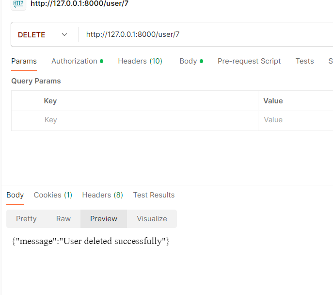

1. Создание нового пользователя (POST /user/new):
Создаёт нового пользователя с данными, переданными в теле запроса в формате JSON.
Обязательные поля: username, email, password.

2. Получение списка пользователей (GET /user/):
Возвращает список всех пользователей в формате JSON.

3. Получение информации о пользователе (GET /user/{id}):
Возвращает информацию о пользователе с указанным id в формате JSON.

4. Обновление информации о пользователе (PUT /user/{id}/edit):
Обновляет данные пользователя с указанным id. Данные передаются в формате JSON.
Поля могут быть частично обновлены (например, только email или пароль).

5. Удаление пользователя (DELETE /user/{id}):
Удаляет пользователя с указанным id.

Как выглядят пользователи после изменений:

7. Авторизация пользователя (POST /user/login):
Осуществляет авторизацию пользователя по email и паролю, переданным в формате JSON.
